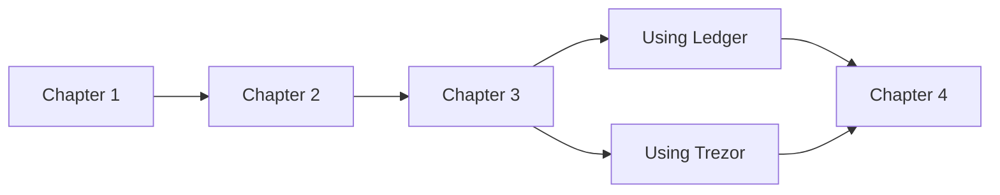
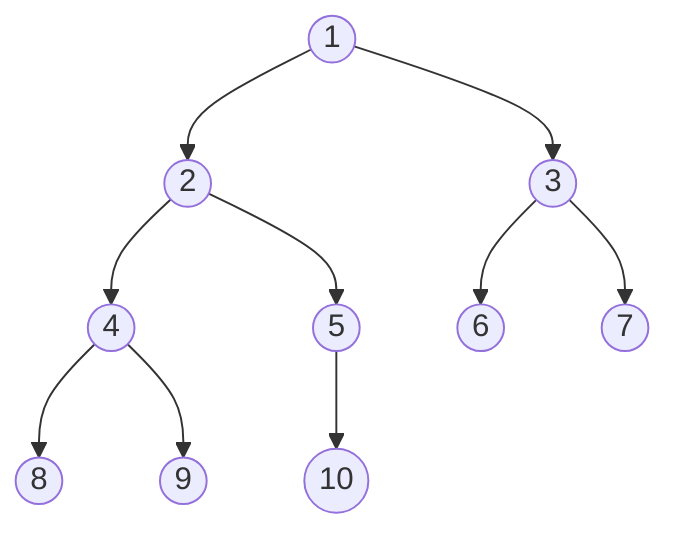
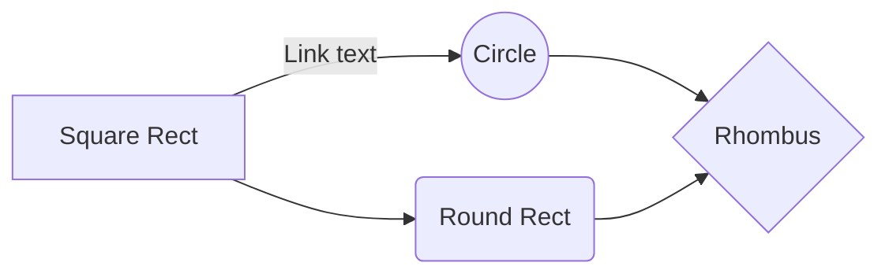

## Simple Graph to Mark Chapters

```mermaid
flowchart LR
    a[Chapter 1] --> b[Chapter 2] --> c[Chapter 3]
    c-->d[Using Ledger]
    c-->e[Using Trezor]
    d-->f[Chapter 4]
    e-->f
```
---

## Binary Tree

```mermaid
graph TB
    A((1))-->B((2))
    A-->C((3))
    B-->D((4))
    B-->E((5))
    C-->F((6))
    C-->G((7))
    D-->H((8))
    D-->I((9))
    E-->J((10))
```

## Graph Shape & Link Variants

```mermaid
graph LR
    A[Square Rect] -- Link text --> B((Circle))
    A --> C(Round Rect)
    B --> D{Rhombus}
    C --> D
```